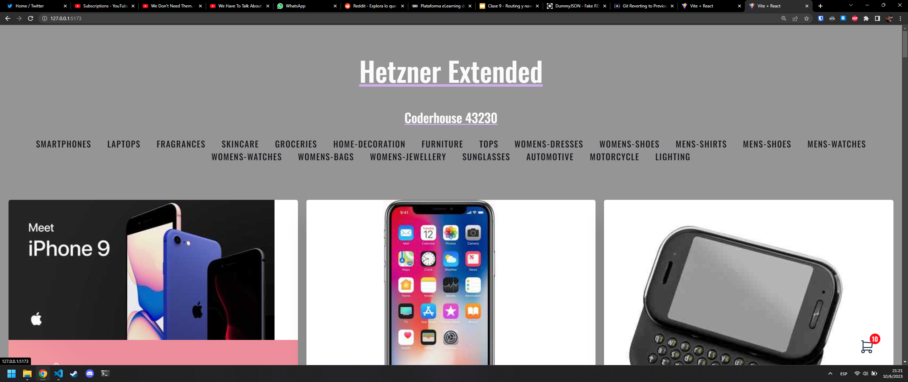
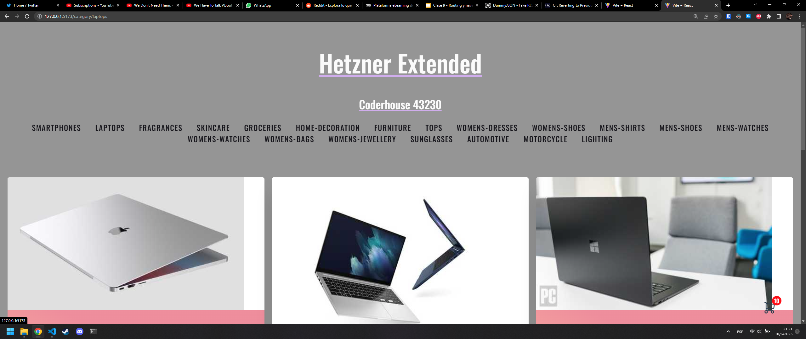
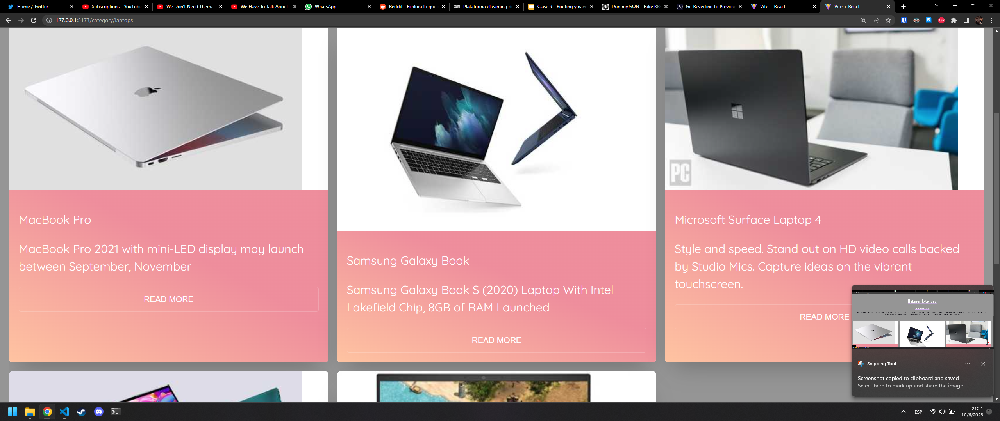
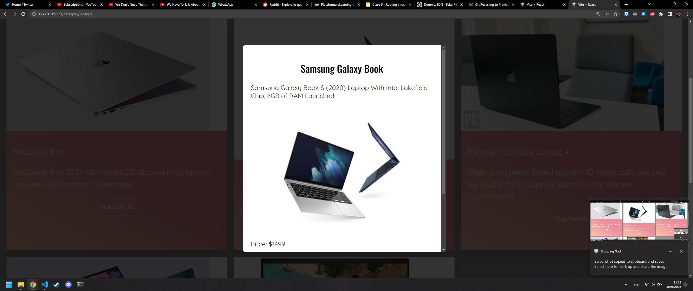

# Curso de ReactJS -> Coderhouse 43230

## 10/06/2023 Segunda pre-entrega del proyecto final
### Ignacio Muñoz
#### React Router

* Se modificaron todos los elementos para trabajar con \<Link\> en lugar de \<a\>.
* Los componentes están estructurados de la siguiente manera:
  * \<Branding\> lleva a '/', renderizando \<ItemListContainer\>
  * \<Navbar\> lleva a '/category/:category', renderizando también \<ItemListContainer\>. Utilizo :category en lugar de algun :categoryId simplemente porque dummyjson no me da un id numerico.
  * \<ItemListContainer\> determina si mostrar todos los productos o sólo los de una categoría en particular según si hay un parámetro de categoría en la URL. En cualquiera de los dos casos, llama a la API de dummyjson para obtener los productos que correspondan y los renderiza a través de \<ItemCard\>
  * \<ItemCard\> renderiza \<ItemDetail\> en un modal al hacer click en el boton 'Read more'
  * \<ItemDetail\> es renderizado dentro de la misma página como un modal, no hago uso de una nueva ruta por un simple motivo: mis llamadas a la API de dummyjson ya me devuelven todos los datos que yo necesito para renderizar el producto, así que tengo todos los datos en memoria dentro de mi objeto "item". Hacer una nueva llamada a la API para que me devuelva el mismo objeto no tiene sentido A ESTA ESCALA. Si tuviera 30 millones de productos ahí sí tendría que manejar todo a través de llamadas a cada producto individualmente, pero no es el caso.
* Para testearlo:
````bash
git clone https://github.com/cyphersprojekt/React43230.git
cd React43230/vite-project
npm install
npm run dev
````





## 13/05/2023 Primera pre-entrega del proyecto final
### Ignacio Muñoz
* El proyecto trabaja con Vite y ReactJS
* Estoy al tanto de que mi ShoppingCart se encuentra por fuera de la NavBar, (es por diseño, quiero que esté abajito)
* Tenía pensado utilizar @tabler/icons-react pero no encontré la forma de meter mi iconito del cart así que utilicé directamente el SVG generado por https://tablericons.com/
* Para testearlo:
````bash
git clone https://github.com/cyphersprojekt/React43230.git
cd React43230/vite-project
npm install
npm run dev
````

<sub>Hetzner por favor no me demandes por usar tu nombre, justo vi un video de der8auer y me parecio apropado</sub>