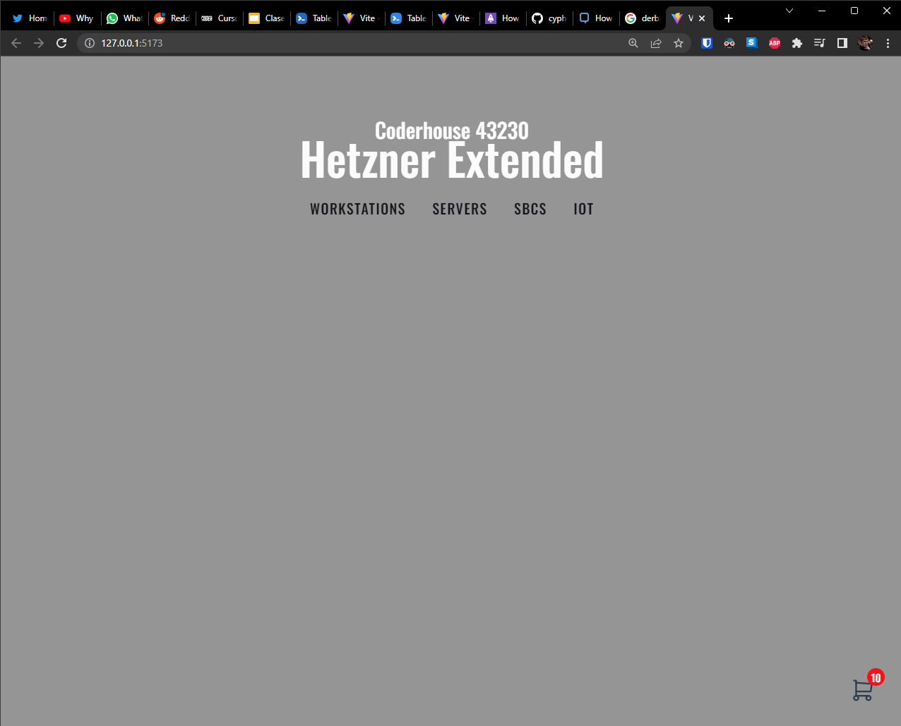

# Curso de ReactJS -> Coderhouse 43230

## 13/05/2023 Primera pre-entrega del proyecto final
### Ignacio Muñoz
* El proyecto trabaja con Vite y ReactJS
* Estoy al tanto de que mi ShoppingCart se encuentra por fuera de la NavBar, (es por diseño, quiero que esté abajito)
* Tenía pensado utilizar @tabler/icons-react pero no encontré la forma de meter mi iconito del cart así que utilicé directamente el SVG generado por https://tablericons.com/
* Para testearlo:
````bash
git clone https://github.com/cyphersprojekt/React43230.git
cd React43230/vite-project
npm install
npm run dev
````

<sub>Hetzner por favor no me demandes por usar tu nombre, justo vi un video de der8auer y me parecio apropado</sub>